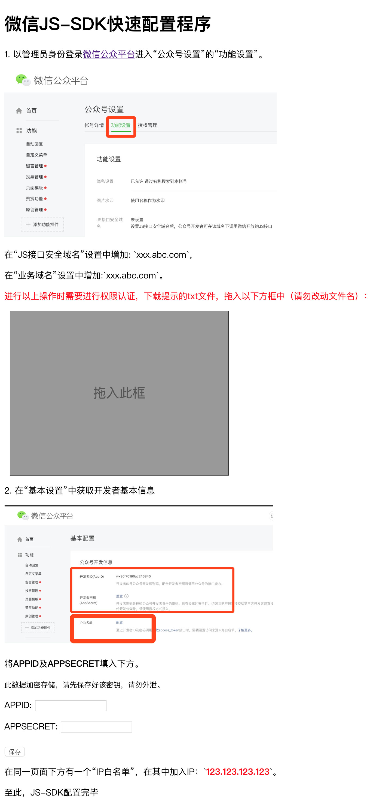

# 多用户微信JS-SDK API服务

## 巧用Koa接管“对接微信开发”的工作

涉及微信开发的技术人员总会面对一些“对接”工作，每当做好一个产品卖给对方的时候，都需要程序员介入进行一些配置。例如：

1. 使用“微信JS-SDK”的应用，我们需要添加微信公众号“JS接口安全域名”。

2. 为了解决微信页面安全提示，我们需要添加微信公众号“业务域名”。

3. 为了在小程序中使用WebView页面，我们需要添加微信小程序“业务域名”。

以上三种情况都不是简单的将域名填入到微信管理后台，而是需要下载一个txt文件，保存到服务器根目录，能够被微信服务器直接访问，才能正常保存域名。  

如果只需要对接一个或几个应用，打开Nginx配置，如下添加：
```ruby
location /YGCSYilWJs.txt {
    default_type text/html;
    return 200 '78362e6cae6a33ec4609840be35b399b';
}
```

假如有几十个甚至几百个项目需要接入😂。  

**让我们花20分钟彻底解决这个问题。**  

进行域名泛解析：`*.abc.com` -\> 服务器，反向代理根目录下`.txt`结尾的请求。顺便配置一下通配符SSL证书（网上有免费版本）。

```ruby
location ~* ^/+?\w+\.txt$ {
        	proxy_http_version 1.1;
        	proxy_set_header X-Real-IP $remote_addr;
        	proxy_set_header X-Forwarded-For $proxy_add_x_forwarded_for;
        	proxy_set_header Host $http_host;
        	proxy_set_header X-NginX-Proxy true;
       		proxy_set_header Upgrade $http_upgrade;
        	proxy_set_header Connection "upgrade";
	        proxy_pass http://127.0.0.1:8362$request_uri;
        	proxy_redirect off;
}
```

创建一个新项目，`yarn add koa`（或许你需要一个[脚手架](https://github.com/yi-ge/koa2-API-scaffold)）。

正如上面所说，我们需要拦截根目录下以`.txt`结尾的请求。因此我们添加koa路由模块`koa-router`。为了处理API中的数据，还需要`koa-body`模块。我们使用`Sequelize`作为ORM，用`Redis`作为缓存。

在入口文件（例如`main.js`）中引入Koa及KoaBody（为了方便阅读，此处为关键代码，并非完整代码，下同）。
```js
import Koa from 'koa'
import KoaBody from 'koa-body'

const app = new Koa()

app.proxy = true

var server = require('http').createServer(app.callback())

app
  .use((ctx, next) => { // 解决跨域
    ctx.set('Access-Control-Allow-Origin', '*')
    ctx.set('Access-Control-Allow-Headers', 'Authorization, DNT, User-Agent, Keep-Alive, Origin, X-Requested-With, Content-Type, Accept, x-clientid')
    ctx.set('Access-Control-Allow-Methods', 'PUT, POST, GET, DELETE, OPTIONS')
    if (ctx.method === 'OPTIONS') {
      ctx.status = 200
      ctx.body = ''
    }
    return next()
  })
  .use(KoaBody({
    multipart: true, // 开启对multipart/form-data的支持
    strict: false, // 取消严格模式，parse GET, HEAD, DELETE requests
    formidable: { // 设置上传参数
      uploadDir: path.join(__dirname, '../assets/uploads/tmpfile')
    },
    jsonLimit: '10mb', // application/json 限制，default 1mb 1mb
    formLimit: '10mb', // multipart/form-data 限制，default 56kb
    textLimit: '10mb' // application/x-www-urlencoded 限制，default 56kb
  }))

server.listen(8362) // 监听的端口号
```

这里没有引用`koa-router`，因为使用传统的`koa-router`方式，阅读起来不够直观，因此我们进行一个简单改造——文件即路由（PS：容易阅读的数据能大幅提高生产力，API如果需要便于阅读，则需要引入swagger等工具，为了方便，我们改造为文件即路由，一眼扫过去的树形数据就是我们的各个API及其结构）。  

文件目录对应到API路径是这样的：  
```js
|-- controller
   |-- :file.txt.js // 对应API：/xxx.txt ，其中ctx.params('file')代表文件名
   |-- index.html
   |-- index.js // 对应API： /
   |-- api
       |-- index.js // 对应API： /api 或 /api/
       |-- weixin-js-sdk
           |-- add.js // 对应API： /api/weixin-js-sdk/add
           |-- check.js // 对应API： /api/weixin-js-sdk/check
           |-- get.js // 对应API： /api/weixin-js-sdk/get
```

这样一来，API接口的结构一目了然（天然的树形图），而且维护`controller`文件本身即可，无需同步维护一次路由表。  

文件即路由的具体改造方法（参考自：[https://github.com/dominicbarnes/koa-file-router](https://github.com/dominicbarnes/koa-file-router)）：  
```js
import inject, { client } from './inject'
import flatten from 'array-flatten'
import path from 'path'
import Router from 'koa-router'
import eachModule from 'each-module'
var debug = require('debug')('koa-file-router')

const methods = [
  'get',
  'post',
  'put',
  'head',
  'delete',
  'options',
  'data'
]

export const redisClient = client

export default (dir, options) => {
  if (!options) options = {}
  debug('initializing with options: %j', options)
  var router = new Router()
  return mount(router, discover(dir))
}

function discover (dir) {
  var resources = {
    params: [],
    routes: []
  }

  debug('searching %s for resources', dir)

  eachModule(dir, function (id, resource, file) {
    // console.log(id)
    // console.log(file)
    if (id.startsWith('_params')) {
      var name = path.basename(file, '.js')
      debug('found param %s in %s', name, file)
      resources.params.push({
        name: name,
        handler: resource.default
      })
    } else {
      methods.concat('all').forEach(function (method) {
        if (method in resource.default) {
          var url = path2url(id)
          debug('found route %s %s in %s', method.toUpperCase(), url, file)
          resources.routes.push({
            name: resource.name,
            url: url,
            method: method,
            handler: resource.default[method]
          })
        }
      })
    }
  })

  resources.routes.sort(sorter)

  return resources
}

function mount (router, resources) {
  resources.params.forEach(function (param) {
    debug('mounting param %s', param.name)
    router.param(param.name, param.handler)
  })

  let binds = {}
  resources.routes.forEach(function (route) {
    debug('mounting route %s %s', route.method.toUpperCase(), route.url)
    if (route.method === 'data') {
      binds = route.handler()
    }
  })

  resources.routes.forEach(function (route) {
    debug('mounting route %s %s', route.method.toUpperCase(), route.url)
    // console.log('mounting route %s %s', route.method.toUpperCase(), route.url)
    if (route.method !== 'data') {
      route.handler = route.handler.bind(Object.assign(binds, inject))
      let args = flatten([route.url, route.handler])
      if (route.method === 'get' && route.name) args.unshift(route.name)
      router[route.method].apply(router, args)
      // router[route.method](route.url, route.handler)
    }
  })

  // console.log(router)

  return router
}

function path2url (id) {
  var parts = id.split(path.sep)
  var base = parts[parts.length - 1]

  if (base === 'index') parts.pop()
  return '/' + parts.join('/')
}

function sorter (a, b) {
  var a1 = a.url.split('/').slice(1)
  var b1 = b.url.split('/').slice(1)

  var len = Math.max(a1.length, b1.length)

  for (var x = 0; x < len; x += 1) {
    // same path, try next one
    if (a1[x] === b1[x]) continue

    // url params always pushed back
    if (a1[x] && a1[x].startsWith(':')) return 1
    if (b1[x] && b1[x].startsWith(':')) return -1

    // normal comparison
    return a1[x] < b1[x] ? -1 : 1
  }
}
```

在代码的第一行引入一个`inject.js`文件，这个文件主要是注入一些数据到对应的函数中，模拟前端vue的写法：
```js
import utils from './lib/utils'
import { Redis } from './config'
import redis from 'redis'
import { promisify } from 'util'
import plugin from './plugins'
import fs from 'fs'
import path from 'path'
import Sequelize from 'sequelize'
import jwt from 'jsonwebtoken'

const publicKey = fs.readFileSync(path.join(__dirname, '../publicKey.pub'))

export const client = redis.createClient(Redis)

const getAsync = promisify(client.get).bind(client)

const modelsDir = path.join(__dirname, './models')
const sequelize = require(modelsDir).default.sequelize
const models = sequelize.models

export default {
  $plugin: plugin,
  $utils: utils,
  Model: Sequelize,
  model (val) {
    return models[val]
  },
  /**
   * send success data
   */
  success (data, status = 1, msg) {
    return {
      status,
      msg,
      result: data
    }
  },
  /**
   * send fail data
   */
  fail (data, status = 10000, msg) {
    return {
      status,
      msg,
      result: data
    }
  },
  /**
   * 通过Redis进行缓存
   */
  cache: {
    set (key, val, ex) {
      if (ex) {
        client.set(key, val, 'PX', ex)
      } else {
        client.set(key, val)
      }
    },
    get (key) {
      return getAsync(key)
    }
  },
  /**
   * 深拷贝对象、数组
   * @param  {[type]} source 原始对象或数组
   * @return {[type]}        深拷贝后的对象或数组
   */
  deepCopy (o) {
    if (o === null) {
      return null
    } else if (Array.isArray(o)) {
      if (o.length === 0) {
        return []
      }
      let n = []
      for (let i = 0; i < o.length; i++) {
        n.push(this.deepCopy(o[i]))
      }
      return n
    } else if (typeof o === 'object') {
      let z = {}
      for (let m in o) {
        z[m] = this.deepCopy(o[m])
      }
      return z
    } else {
      return o
    }
  },
  async updateToken (userGUID, expiresIn = '365d') {
    const userInfo = await models['user'].findOne({
      where: {
        userGUID
      }
    })

    models['userLog'].create({
      userGUID: userInfo.userGUID,
      type: 'update'
    })

    const token = jwt.sign({
      userInfo
    }, publicKey, {
      expiresIn
    })

    return token
  },

  decodeToken (token) {
    return jwt.verify(token.substr(7), publicKey)
  }
}

```

以上文件所实现的效果是这样的：
```js
// 示例Controller文件

export default {
  async get (ctx, next) { // get则是GET请求，post则为POST请求，其余同理
	this.Model // inject.js文件中注入到this里面的Sequelize对象
	this.model('abc') // 获取对应的model对象，abc即为sequelize.define('abc'...
	this.cache.set('key', 'value') // 设置缓存，例子中用Redis作为缓存
	this.cache.get('key') //获取缓存
    ctx.body = this.success('ok') // 同理，由injec.js注入
    next()
  }
}

```

看到上面的写法，是不是有一种在写vue的感觉？  

为了获取参数更为方便，我们进行一些优化。添加一个controller中间件：
```js
const defaultOptions = {}

export default (options, app) => {
  options = Object.assign({}, defaultOptions, options)
  return (ctx, next) => {
    ctx.post = function (name, value) {
      return name ? this.request.body[name] : this.request.body
    }
    ctx.file = function (name, value) {
      return name ? ctx.request.body.files[name] : ctx.request.body.files
    }
    ctx.put = ctx.post
    ctx.get = function (name, value) {
      return name ? this.request.query[name] : this.request.query
    }
    ctx.params = function (name, value) {
      return name ? this.params[name] : this.params
    }
    return next()
  }
}
```

这样一来，我们在controller文件中的操作是这个效果：  

```js
// 示例Controller文件, 文件路径对应API路径

export default {
  async get (ctx, next) { // GET请求
	ctx.get() // 获取所有URL参数
	ctx.get('key') // 获取名称为'key'的参数值
	ctx.params('xxx') // 如果controller文件名为“:”开头的变量，例如:xxx.js，则此处获取xxx的值，例如文件名为“:file.txt.js”，请求地址是“ok.txt”，则ctx.params('file')的值为“ok”
    ctx.body = this.success('ok')
    next()
  },
  async post (ctx, next) { // POST请求
	// 在POST请求中，除了GET请求的参数获取方法，还可以用：
	ctx.post() // 用法同ctx.get()
	ctx.file() // 上传的文件
    ctx.body = this.success('ok')
    next()
  },
  async put (ctx, next) { // PUT请求
	// 在PUT请求中，除了有GET和POST的参数获取方法，还有ctx.put作为ctx.post的别名
    ctx.body = this.success('ok')
    next()
  },
  async delete (ctx, next) { // DELETE请求
	// 参数获取方法同post
    ctx.body = this.success('ok')
    next()
  },
  async ...
}
```

当然，光有以上用法还不够，还得加上一些快速操作数据库的魔法（基于`Sequelize`）。

添加[auto-migrations](https://github.com/yi-ge/auto-migrations)模块，在`gulp`中监控`models`文件夹中的变化，如果添加或者修改了model，则自动将model同步到数据库作为数据表（类似Django，试验用法，请勿用于生产环境）。具体配置参考源码。

在models文件夹中新建文件`weixinFileIdent.js`，输入一下信息，保存后则数据库中将自动出现`weixinFileIdent`表。

```js
export default (sequelize, DataTypes) => {
  const M = sequelize.define('weixinFileIdent', {
    id: {
      type: DataTypes.BIGINT.UNSIGNED,
      allowNull: false,
      primaryKey: true,
      autoIncrement: true
    },
    name: {
      type: DataTypes.STRING(255),
      allowNull: false
    },
    content: {
      type: DataTypes.STRING(255),
      allowNull: true
    }
  })
  M.associate = function (models) {
    // associations can be defined here
  }
  return M
}
```

在controller文件夹中添加`:file.txt.js`文件。

```js
export default {
  async get (ctx, next) {
    const fileContent = await this.model('weixinFileIdent').findOne({
      where: {
        name: ctx.params('file')
      },
      order: [
        ['updatedAt', 'DESC']
      ]
    })

    ctx.set('Content-Type', 'text/plain; charset=utf-8')

    if (fileContent) {
      ctx.body = fileContent.content
      next()
    } else {
      ctx.body = ''
      next()
    }
  }
}

```

在用户访问`https://域名/XXX.txt`文件的时候，读取数据库中保存的文件内容，以文本的方式返回。这样一来，微信的验证服务器方会通过对该域名的验证。  

同理，我们需要一个添加数据的接口`controller/api/check.js`（仅供参考）。  

```js
export default {
  async get (ctx, next) {
    await this.model('weixinFileIdent').create({ // 仅演示逻辑，没有验证是否成功，是否重复等。
      name: ctx.get('name'),
      content: ctx.get('content')
    })
    ctx.body = {
      status: 1
    }
    next()
  }
}
```

当我们访问`https://域名/api/weixin-js-sdk/check?name=XXX&content=abc`的时候，将插入一条数据到数据库中，记录从微信后台下载的文件内容，当访问`https://域名/XXX.txt`的时候，将返回文件内容（此方法通用于文初提到的三种场景）。  

按照同样的方法，我们实现多用户JS-SDK配置信息返回。

定义模型（C+S保存后自动创表）：
```js
export default (sequelize, DataTypes) => {
  const M = sequelize.define('weixinJSSDKKey', {
    id: {
      type: DataTypes.BIGINT.UNSIGNED,
      allowNull: false,
      primaryKey: true,
      autoIncrement: true
    },
    domain: {
      type: DataTypes.STRING(255),
      allowNull: false
    },
    APPID: {
      type: DataTypes.STRING(255),
      allowNull: false
    },
    APPSECRET: {
      type: DataTypes.STRING(255),
      allowNull: true
    }
  })
  M.associate = function (models) {
    // associations can be defined here
  }
  return M
}

```

`controller/api/weixin-js-sdk/add.js`文件：

```js
export default {
  async get (ctx, next) {
    await this.model('weixinJSSDKKey').create({
      domain: ctx.get('domain'),
      APPID: ctx.get('APPID'),
      APPSECRET: ctx.get('APPSECRET')
    })
    ctx.body = {
      status: 1,
      msg: '添加成功'
    }
    next()
  }
}
```

同理，当我们访问`https://域名/api/weixin-js-sdk/add?domain=XXX&APPID=XXX&APPSECRET=XXX`的时候，将插入一条数据到数据库中，记录该用户的二级域名前缀，公众号的`APPID`和`APPSECRET`。  

`controller/api/weixin-js-sdk/get.js`文件，依赖于`co-wechat-api`模块。

```js

const WechatAPI = require('co-wechat-api')

export default {
  async get (ctx, next) {
    const weixinJSSDKKey = this.model('weixinJSSDKKey')
    const domain = ctx.header.host.substring(0, ctx.header.host.indexOf('.abc.com')) // 根域名
    const result = await weixinJSSDKKey.findOne({
      where: {
        domain
      },
      order: [
        ['updatedAt', 'DESC']
      ]
    })
    if (result) {
      const APPID = result.APPID
      const APPSECRET = result.APPSECRET

      if (ctx.query.url) {
        const api = new WechatAPI(APPID, APPSECRET, async () => {
          // 传入一个获取全局token的方法
          let txt = null
          try {
            txt = await this.cache.get('weixin_' + APPID)
          } catch (err) {
            console.log(err)
            txt = '{"accessToken":"x","expireTime":1520244812873}'
          }
          return txt ? JSON.parse(txt) : null
        }, (token) => {
          // 请将token存储到全局，跨进程、跨机器级别的全局，比如写到数据库、redis等
          // 这样才能在cluster模式及多机情况下使用，以下为写入到文件的示例
          this.cache.set('weixin_' + APPID, JSON.stringify(token))
        })

        var param = {
          debug: false,
          jsApiList: [ // 需要用到的API列表
            'checkJsApi',
            'onMenuShareTimeline',
            'onMenuShareAppMessage',
            'onMenuShareQQ',
            'onMenuShareWeibo',
            'hideMenuItems',
            'showMenuItems',
            'hideAllNonBaseMenuItem',
            'showAllNonBaseMenuItem',
            'translateVoice',
            'startRecord',
            'stopRecord',
            'onRecordEnd',
            'playVoice',
            'pauseVoice',
            'stopVoice',
            'uploadVoice',
            'downloadVoice',
            'chooseImage',
            'previewImage',
            'uploadImage',
            'downloadImage',
            'getNetworkType',
            'openLocation',
            'getLocation',
            'hideOptionMenu',
            'showOptionMenu',
            'closeWindow',
            'scanQRCode',
            'chooseWXPay',
            'openProductSpecificView',
            'addCard',
            'chooseCard',
            'openCard'
          ],
          url: decodeURIComponent(ctx.query.url)
        }

        ctx.body = {
          status: 1,
          result: await api.getJsConfig(param)
        }
        next()
      } else {
        ctx.body = {
          status: 10000,
          err: '未知参数'
        }
        next()
      }
    } else {
      ctx.body = ''
      next()
    }
  }
}

```


JS-SDK配置数据获取地址：`https://域名/api/weixin-js-sdk/get?APPID=XXX&url=XXX`，第二个XXX为当前页面的地址。一般为`encodeURIComponent(window.location.origin) + '/'`，如果当前页面存在'/#/xxx'，则为`encodeURIComponent(window.location.origin) + '/#/'`。

返回的数据中的result即为`wx.config(result)`。

最后，我们再写一个简单的html页面作为引导（[http://localhost:8362/?name=xxx](http://localhost:8362/?name=xxx)）：



完整示例源代码：[https://github.com/yi-ge/weixin-js-sdk-api](https://github.com/yi-ge/weixin-js-sdk-api)